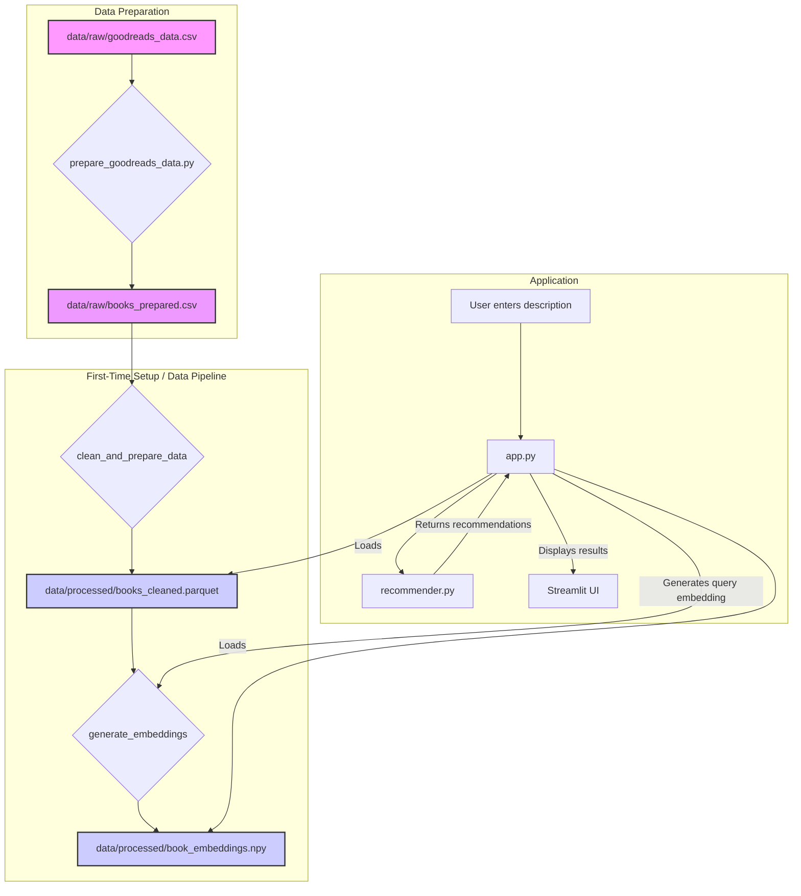

# 📘 Open-Source Book Recommender MVP

This project is a Content-Based Book Recommender MVP built using a 100% open-source Python stack. It uses sentence embeddings to find books with similar content and provides a simple, modern web interface to discover books based on a text description.

## ✨ Features


-   **Semantic Search**: Instead of selecting a title, describe the book you want to read, and the recommender will find matching books based on semantic meaning.

-   **Content-Based Recommendations**: Finds similar books using semantic meaning, not just keywords.

-   **Modern Web UI**: A clean, card-based interface built with Streamlit that displays book covers and expandable details.

-   **Open-Source Stack**: Built entirely with free and open-source tools.

-   **Modular & Extendable**: Code is organized into logical modules for data processing, embedding, and recommending, making it easy to extend.

-   **Automated Setup**: The Streamlit app can automatically process data and generate embeddings on its first run.


## 🚀 Recent UI/UX Improvements (November 2025)


This section details significant UI/UX enhancements and performance optimizations implemented in November 2025 to address critical issues and modernize the application's interface.


### ✨ Key Improvements:


-   **Enhanced Card Alignment**:

    -   Implemented a robust Flexbox hierarchy for Streamlit columns and book cards, ensuring consistent card heights regardless of content length (e.g., long titles, varied genre counts, missing descriptions).

    -   Buttons within cards (`View Details`) are now consistently aligned at the bottom using `margin-top: auto;`.

    -   Titles are clamped to 2 lines, authors to 1 line, and genres are constrained to a fixed height to prevent vertical misalignment.

-   **Deprecated Streamlit API Resolution**:

    -   Replaced all instances of `use_container_width=True` with `width="stretch"` for buttons, resolving deprecation warnings and ensuring forward compatibility.

-   **Comprehensive CSS Structure**:

    -   Introduced and refined essential CSS classes (`.book-content`, `.book-info-section`, `.card-actions`, `.book-cover-container`) to support the new Flexbox-driven card layout and enhance visual consistency.

    -   Fixed book cover aspect ratios and improved styling for badges, ratings, and genre pills.

-   **Optimized Main Display Loop**:

    -   Refactored the book display logic to correctly pass unique indices to `render_book_card()`, preventing potential Streamlit key collisions.

    -   Integrated filter application directly into the display loop for dynamic content rendering.

    -   Implemented efficient batch pre-loading of book covers for visible books (up to 12 at a time), significantly improving initial render performance.

-   **Minor Code Quality & UI Polish**:

    -   Ensured empty rating and genre divs (`.rating-stars`, `.genre-container`) maintain their visual space using non-breaking spaces (`&nbsp;`) for consistent alignment.

    -   Centered the search example buttons (`Fantasy`, `Mystery`, `Romance`) for a more balanced and aesthetically pleasing search interface.

    -   Adjustd the margins for the results header (`.results-header`) to improve overall page spacing.


These updates collectively deliver a more stable, performant, and visually appealing user experience.

---

## ⚙️ Tech Stack

- **Python 3.10+**
- **Streamlit**: For the web application UI.
- **Sentence-Transformers**: For generating high-quality sentence embeddings (`all-MiniLM-L6-v2`).
- **FAISS**: For efficient, fast similarity search.
- **Pandas**: For data manipulation.
- **Requests**: For fetching data from external APIs (e.g., book covers).
- **Pytest**: For running unit tests.

---

## 🛠️ Configuration

The application's settings are centralized in `src/config.py`. You can modify this file to customize various aspects of the recommender.

-   **File Paths**:
    -   `RAW_DATA_PATH` should point to the **prepared** data file (`books_prepared.csv` by default).
-   **Embedding Model**:
    -   `EMBEDDING_MODEL`: The name of the Sentence-Transformer model to use. You can swap this for larger models for better quality at the cost of performance.
-   **Recommender Settings**:
    -   `DEFAULT_TOP_K`: The number of recommendations to return.
    -   `MIN_SIMILARITY_THRESHOLD`: The minimum similarity score a book must have to be included in the results. Decrease this if you are not getting enough recommendations.

---

## 🚀 Getting Started

### 1. Prerequisites

- Python 3.10 or higher
- `pip` for package management

### 2. Clone the Repository

```bash
git clone <your-repo-url>
cd book-recommender
```

### 3. Create a Virtual Environment (Recommended)

```bash
# For Windows
python -m venv venv
venv\Scripts\activate

# For macOS/Linux
python3 -m venv venv
source venv/bin/activate
```

### 4. Install Dependencies

Install all the required packages from `requirements.txt`:

```bash
pip install -r requirements.txt
```

### 5. Add and Prepare the Data

This project is configured to work with the `goodreads_data.csv` dataset.

1.  **Add your dataset**: Place your `goodreads_data.csv` file inside the `data/raw/` directory.
2.  **Prepare the data**: Run the preprocessing script to convert the data into the format the application expects.

```bash
python scripts/prepare_goodreads_data.py
```

This script will create a new file, `data/raw/books_prepared.csv`, which the main application will use.

### 6. Run the Application

Launch the Streamlit web application by running:

```bash
streamlit run app.py
```

The first time you run the app, it will automatically process your prepared CSV and generate the embeddings. This might take a few minutes depending on the size of your dataset and your computer's hardware. Subsequent launches will be much faster.

---

## 🧪 Running Tests

To ensure everything is working as expected, you can run the suite of unit and integration tests.

First, install the development dependencies:
```bash
pip install -r requirements-dev.txt
```

Then, run `pytest` from the root of the project:
```bash
pytest
```

---

## 🏗️ Project Structure

The project is organized into a modular structure:

```
project_root/
├── data/
│   ├── raw/
│   │   ├── goodreads_data.csv  # Raw input data
│   │   └── books_prepared.csv  # Prepared data
│   └── processed/
│       ├── books_cleaned.parquet # Cleaned data
│       └── book_embeddings.npy   # Stored embeddings
├── scripts/
│   ├── prepare_goodreads_data.py # Data preparation script
│   └── download_model.py       # Model pre-downloader
├── src/
│   ├── __init__.py
│   ├── app.py                  # Main Streamlit application
│   ├── config.py               # Central configuration
│   ├── data_processor.py       # Data cleaning and feature engineering
│   ├── embedder.py             # Embedding generation logic
│   ├── recommender.py          # Recommendation logic
│   └── utils.py                # Utility functions
├── tests/                      # Unit and integration tests
...
```

---
## 🏛️ Architecture

The application follows a simple data processing and serving pipeline, orchestrated by the Streamlit application.



---

## 🌟 Future Enhancements & Deployment Considerations

This MVP provides a solid foundation. Here are some areas for future development:

-   **Data & Model Versioning**: For production, consider implementing a robust data and model versioning system (e.g., [DVC - Data Version Control](https://dvc.org/)) to track changes and ensure reproducibility.
-   **API Layer**: Integrate a RESTful API (e.g., using [FastAPI](https://fastapi.tiangolo.com/)) to allow programmatic access to the recommendation engine.
-   **Scalability**: For very large datasets, explore more advanced Approximate Nearest Neighbor (ANN) indexes in FAISS (e.g., `IndexIVFFlat`).
-   **Advanced UI/UX**: Add features like autocomplete for search, mobile responsiveness improvements, dark mode, and a user feedback mechanism.

---

## ❓ Troubleshooting

**1. `ModuleNotFoundError` when running `app.py` or other scripts.**
   - **Cause**: The Python interpreter cannot find the project's `src` package.
   - **Solution**: Ensure you are running commands from the **project root directory**. If you have fixed the imports to be absolute (e.g., `from src.utils ...`), this should work correctly for `streamlit run app.py`. For standalone scripts, ensure they contain the necessary logic to add the project root to `sys.path`.

**2. `DataNotFoundError` on first run.**
   - **Cause**: The application cannot find the prepared dataset.
   - **Solution**: Make sure you have run the preparation script first (`python scripts/prepare_goodreads_data.py`) and that `data/raw/books_prepared.csv` exists.

**3. The application is very slow on the first run.**
   - **Cause**: On its first launch, the app needs to download the embedding model (~80MB) and generate embeddings for all books.
   - **Solution**: This is expected. Subsequent runs will be much faster as the data is cached.

**4. Error after updating the `goodreads_data.csv` file.**
    - **Cause**: The application uses cached processed data. If you update the raw data, you must regenerate the prepared and processed files.
    - **Solution**: Delete the contents of the `data/processed/` directory and the `data/raw/books_prepared.csv` file, then re-run the entire pipeline starting with the preparation script.
      ```bash
      # Use with caution!
      rm data/processed/*
      rm data/raw/books_prepared.csv
      python scripts/prepare_goodreads_data.py
      streamlit run app.py
      ```
