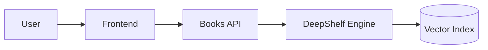

# 📚 Serendipity (powered by DeepShelf)

  

**Serendipity** is a modern book discovery interface that helps you find your next favorite story based on "vibes", plot descriptions, and semantic meaning—not just keywords.

It is powered by **DeepShelf**, a custom high-performance Semantic Search Engine that understands the content of 100,000+ books using Vector Embeddings and Neural Retrieval.

> *"Don't search for 'fantasy books'. Search for 'a political drama about dragons where the villain is actually right'."*

---

## 🚀 Key Features

### 🎨 Serendipity (The Experience)
*   **Natural Language Search:** Type exactly what you're looking for in plain English.
*   **Instant "Vibe" Checks:** See why a book was recommended (e.g., "95% Plot Match", "80% Tone Match").
*   **Smart Personalization:** "Login" as different personas (e.g., Sci-Fi Geek, Cozy Mystery Fan) to see how recommendations adapt.
*   **Beautiful UI:** A clean, "dark mode first" interface designed for readers.

### 🧠 DeepShelf (The Engine)
*   **Semantic Understanding:** Uses `all-MiniLM-L6-v2` (Sentence Transformers) to encode book metadata into 384-dimensional vectors.
*   **Hybrid Retrieval:** Combines **Dense Vector Search** (FAISS) with **Keyword Filtering** for maximum accuracy.
*   **Performance Optimized:**
    *   **IVF-PQ Indexing:** Compresses the vector index by **48x** (150MB -> 3MB) for lightning-fast searches.
    *   **Microservice Arch:** Runs as a standalone Dockerized API (FastAPI).
*   **Cold Start Solved:** Can recommend books purely based on content similarity, with zero user history required.

---

## 🏗️ Architecture

The system consists of three main components:

1.  **Frontend (`/serendipity-web`):** A React + Tailwind application.
2.  **Books API (`/book-api`):** The gateway API that handles user requests, product data, and logic.
3.  **DeepShelf Engine (`/deepshelf-engine`):** The dedicated vector search microservice (deployed on Hugging Face).


## 🚀 Setup Instructions

### Prerequisites
*   Python 3.10+
*   Node.js 18+ (for Frontend)
*   Git
*   Docker (Optional but recommended)

### 1. Clone the Repository
```bash
git clone <your-repo-url>
cd books
```

### 2. Backend Setup
It is recommended to use a virtual environment.

```bash
# Install uv (fast pip replacement)
pip install uv

# Create and activate venv
uv venv
# Windows: .venv\Scripts\activate
# Mac/Linux: source .venv/bin/activate

# Install dependencies
uv pip install -r requirements.txt
```

### 3. Data Preparation (The "Magic" Step)
You have two options: **Download Pre-computed Data** (Fast) or **Generate from Scratch** (Slow).

**Option A: Download (Recommended)**
The app includes a script to pull processed data (embeddings, clusters) from Hugging Face.
```bash
python scripts/download_data.py
```

**Option B: Generate from Scratch**
If you want to process the raw CSV yourself (takes ~2-3 hours on CPU):
```bash
# 1. Clean and Prepare Raw Data
python scripts/prepare_100k_data.py
python src/book_recommender/data/processor.py

# 2. Generate Embeddings (The heavy lifting)
python src/book_recommender/ml/embedder.py

# 3. Pre-compute Clusters
python scripts/precompute_clusters.py
```

### 4. Run the Application

**Start the Backend API (Port 8000):**
```bash
python src/book_recommender/api/main.py
# API will run at http://localhost:8000
# Docs at http://localhost:8000/docs
```

**Start the React Frontend:**
```bash
cd frontend
npm install
npm run dev
# UI will run at http://localhost:5173
```

---

## 🐳 Docker Deployment

The project is fully Dockerized.

```bash
# Build and Run Backend
docker build -t bookfinder-api -f docker/Dockerfile.backend .
docker run -p 8000:8000 bookfinder-api
```

*Note: The Docker container automatically runs `scripts/download_data.py` on startup to fetch the latest data artifacts.*

---

## 🧪 Usage Examples

**API Request (Recommendation):**
```bash
curl -X POST "http://localhost:8000/recommend/query" \
     -H "Content-Type: application/json" \
     -d '{"query": "cyberpunk detective in neo-tokyo", "top_k": 5}'
```

**API Request (Explainability):**
```bash
curl -X POST "http://localhost:8000/explain" \
     -d '{"query_text": "...", "recommended_book": {...}, "similarity_score": 0.85}'
```

## 📄 License
Distributed under the MIT License. See `LICENSE` for more information.
